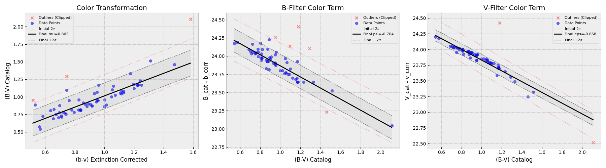

# Color Transformation Calibration Report

Analyzed 63 common stars.
Applied 2-sigma iterative outlier rejection.
Applied Extinction Correction:
- B-Filter: k=0.35, X=1.055
- V-Filter: k=0.20, X=1.109

## Derived Coefficients (Cleaned)
- **$\mu$ (Color Scale):** 0.8030  (R=0.882)
- **$\psi$ (B-Term):** -0.7638  (R=-0.915)
- **$\epsilon$ (V-Term):** -0.8583  (R=-0.965)

## Transformation Equations
Using these coefficients, your calibrated magnitudes are:
1. $(B-V)_{std} = 0.803 \cdot (b-v)_{corr} + 0.210$
2. $V_{std} = v_{corr} + -0.858 \cdot (B-V)_{std} + 24.689$
*(Note: v_corr is the instrumental magnitude corrected for extinction)*

